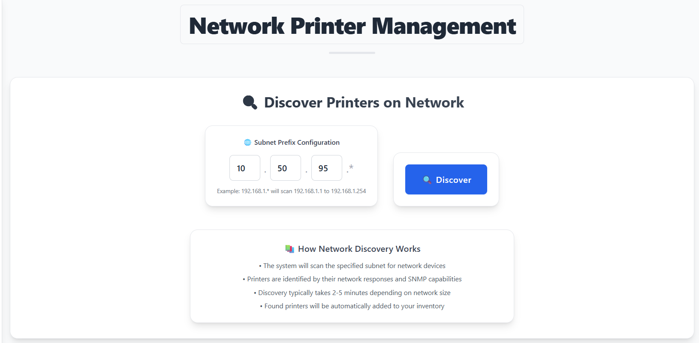

# Système de Gestion d'Imprimantes Réseau:
Une application full-stack complète pour gérer les imprimantes réseau en utilisant le protocole SNMP, cette application offre la possibilité de découverte automatisée, de surveillance et de reporting.

# fonctionalités offertes par le projet:
Ce système fournit une plateforme centralisée pour :

* Découvrir automatiquement les imprimantes sur votre réseau
* Surveiller le statut, les niveaux de toner et les compteurs de pages en temps réel
* Gérer l'inventaire des imprimantes en utilisant le filtrage et la recherche
* Exporter les données d'imprimantes vers Excel pour les rapports
* Recevoir des rapports email automatisés pour les imprimantes hors ligne

# Architecture:

* Frontend : React.js avec Tailwind CSS
* Backend : Spring Boot
* Base de données : PostgreSQL
* Communication : Protocole SNMP pour la communication avec les imprimantes
* Containerisation : Docker avec Docker Compose

# Démarrage Rapide:

## Prérequis
* 1- Docker et Docker Compose installés
* 2- Accès réseau aux sous-réseaux d'imprimantes
* 3- Compte Gmail pour les notifications email (optionnel)

# Installation
## 1- Cloner le dépôt


```bash
git clone https://github.com/medachbab/PrintersManagement.git
cd PrintersManagement
```

## 2- Configurer les paramètres email (Optionnel)

**!!!Important : Pour Gmail, vous devez :**

* Activer l'authentification à 2 facteurs
* Générer un mot de passe d'application à partir de google account (pas votre mot de passe normal)
* Utiliser le mot de passe d'application dans la configuration:

modifiez backend/src/main/resources/application.properties :

```java
# Email configuration
spring.mail.host=smtp.gmail.com
spring.mail.port=587
spring.mail.username=your-email@gmail.com
spring.mail.password=your-app-password
```


## 3- Configurer l'email de l'expéditeur dans le Service

modifiez PrinterService.java et mettez à jour le destinataire email :
```java
emailService.sendEmailWithAttachment(
    "recipient-email@company.com",  // ← metre ici l'email du destinataire (email of the admin)
    "Imprimantes offline",
    "les imprimantes offline.",
    excelBytes,
    fileName
);
```

# Lancer l'application

Si c'est la Première fois que vous installer l'application vous devez construire les images par cette commande:
```bash
docker-compose up -d --build
```
Sinon, utiliser cette commande pour demarer l'application:
```bash
docker-compose up -d
```
# Accéder à l'application:
* Frontend : http://localhost:3000
* API Backend : http://localhost:8080

# Fonctionnalités:
## 1- Découverte d'Imprimantes
* Scan automatique dans le réseau pour trouver les imprimantes dans une plage donnée
* possibilité de choisir la plage IP correspondante
* Suivi de progression en temps réel
### page de scan:


## 2- Surveillance et Gestion
* Surveillance du statut de chaque imprimente en temps réel (En ligne, offline, Impression, etc.)
* Suivi des niveaux de toner avec indicateurs visuels
* Surveillance des compteurs de pages
* possibilité de rafraîchissement manuel
### home page overview


## 3- Reporting et Export
* Export Excel pour toutes les imprimantes ou pour les imprimmentes sélectionnées
* Rapports email automatisés quotidiens pour les imprimantes hors ligne
* Tableau de bord avec statistiques des imprimantes
### export


## 4- Filtrage et Recherche
* Recherche par nom, IP, numéro de série, fabricant ou modèle
* Filtrage par niveaux de toner, compteurs de pages et statut
* Filtrage rapide basé sur le modèle
### exemple de filtre d'un accès simple à des imprimentes spécifiques en utilisant le status


# Schéma de Base de Données:
Le système utilise PostgreSQL avec l'entité principale suivante :

## Entité Imprimante
* Adresse IP, Nom, Modèle, Numéro de Série
* Niveau de Toner, Compteur de Pages, Statut
* Fabricant, Dernier Temps de Rafraîchissement
* Statut d'accessibilité SNMP
# Tâches Planifiées:
* Rafraîchissement automatique : Quotidien à 8h30 et 17h30
* Rapports email : Envoyés avec la liste des imprimantes hors ligne à 8h30 et 17h30 aussi


