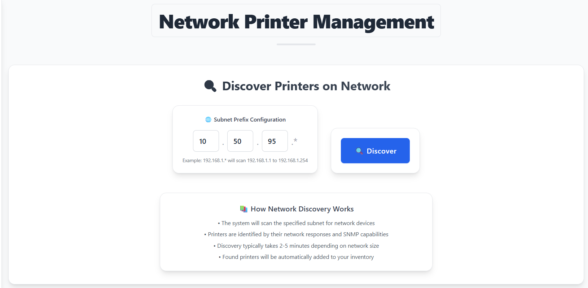
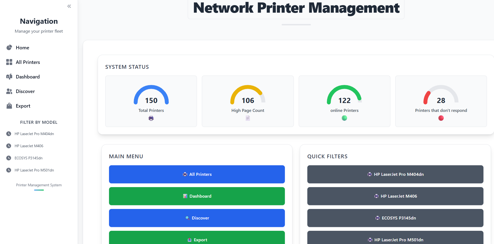
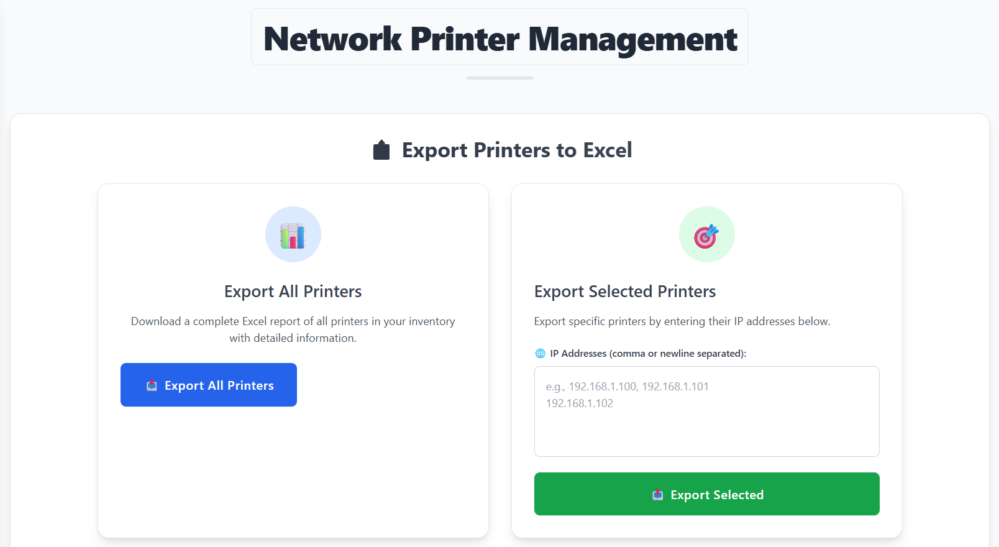
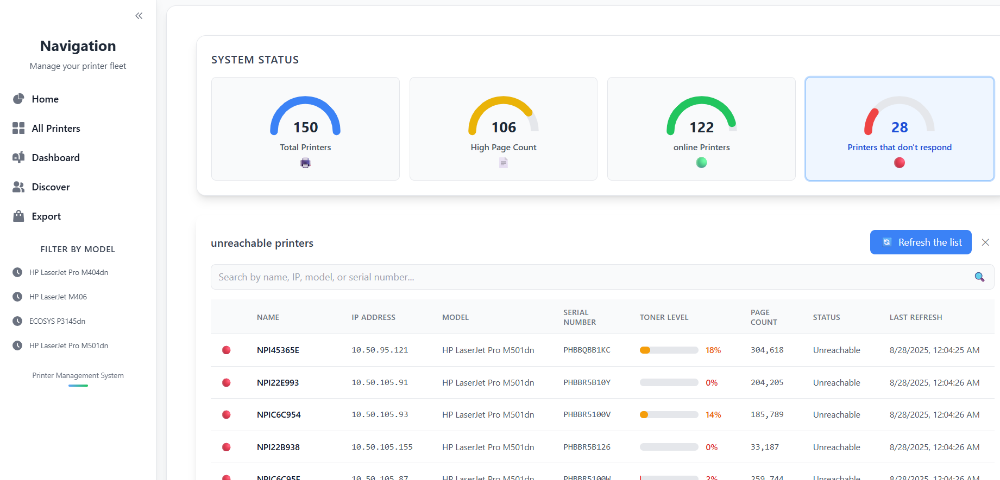

# Network Printer Management System
this project is about a full-stack application for managing network printers using SNMP protocole, this app offers automated discovery, monitoring, and reporting capabilities.

# Project Overview
This system provides a centralized platform to:

* Discover printers on your network automatically
* Monitor printer status, toner levels, and page counts in real-time
* Manage printer inventory with filtering and search capabilities
* Export printer data to Excel for reporting
* Receive automaticaly every shift an email reports for offline printers

# Architecture

- Frontend: React.js with Tailwind CSS
- Backend: Spring Boot
- Database: PostgreSQL
- Communication: SNMP protocol for printer communication
- Containerization: Docker with Docker Compose

# Quick Start

## Prerequisites

* Docker and Docker Compose installed
* Network access to printer subnets
* Gmail account for email notifications (optional)

## 1- Installation

### 1- Clone the repository

```bash
git clone https://github.com/medachbab/PrintersManagement.git
cd PrintersManagement
```

### 2- Configure Email Settings (Optional)

### !!!Important: For Gmail, you need to:

- Enable 2-factor authentication
- Generate an App Password using google account(not your regular password)
- Use the App Password in the configuration:

add your email address and app password in this section of backend/src/main/resources/application.properties :

```java
# Email configuration
spring.mail.host=smtp.gmail.com
spring.mail.port=587
spring.mail.username=your-email@gmail.com
spring.mail.password=your-app-password
```

### 3- Configure Sender Email in Service

Edit "PrinterService.java" and update the email recipient:
```java
emailService.sendEmailWithAttachment(
    "recipient-email@company.com",  // ← Change this to your recipient email (email of the admin)
    "Imprimantes offline",
    "les imprimantes offline.",
    excelBytes,
    fileName
);
```
# Run the application
if it's the first time you have to build the images with this command:
```bash
docker-compose up -d --build
```
after that, if you want to stari the app again just run:
```bash
docker-compose up -d
```
# Features of the app:
## Printer Discovery
an automatic network scanning for printers with configurable ip range scanning for subnetworks and a real time progress tracking
### discover page

## Monitoring & Management
* Real-time status monitoring (Online, Printing, Idle, etc.)
* Toner level tracking with visual indicators
* Page count monitoring
* Manual refresh capabilities

### home page overview


## Reporting & Export
* Excel export for all printers or selected ones
* Automated daily email reports for offline printers
* Dashboard with printer statistics
### export


## Filtering & Search
* Search by name, IP, serial number, manufacturer, or model
* Filter by toner levels, page counts, and status
* Quick model-based filtering
### exemple of filter with easy access to specific printers with status


# Database Schema

The system uses PostgreSQL with the following main entity as in the model file:
## Printer Entity

* IP Address, Name, Model, Serial Number
* Toner Level, Page Count, Status
* Manufacturer, Last Refresh Time
* SNMP Reachability status

# Scheduled Tasks

* Automatic refresh: Daily at 8:30 AM and 5:30 PM
* Email reports: Sent with offline printers list

